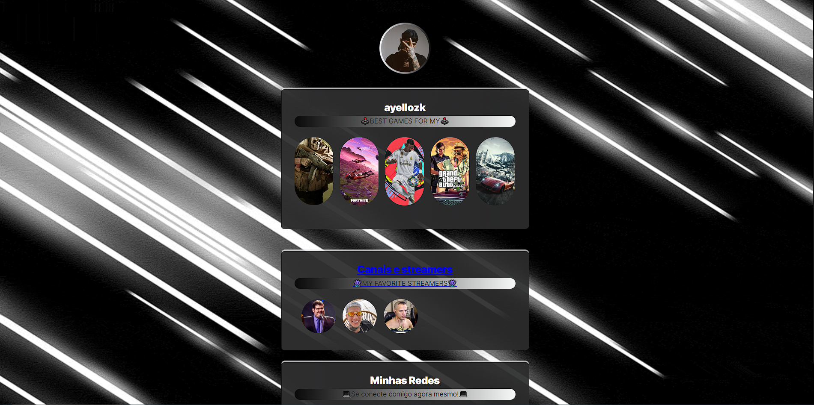

bom,nesse começo sobre o reconhecimento aprendi a ler e entender coisas basicas com mudança de design do site que serviu como um molde  pra mim,e aprendi coisas basicas como mudar escritas mudar foto mudar cor e toda a estrutura do design.e aprender a ler os codigos de forma basica de como tudo é e como funciona.
